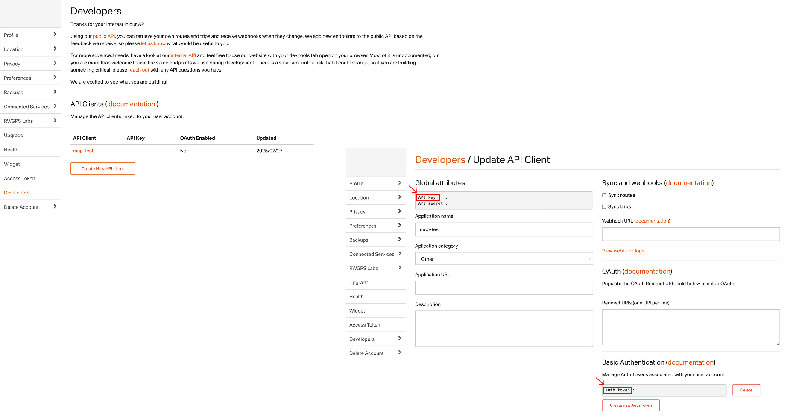

# RideWithGPS MCP Server

> 🚴 **Dear Cyclists!** Welcome to the RideWithGPS MCP Server—your AI-powered companion for managing your cycling adventures. If you like this project, please consider giving it a star, or better yet, becoming a contributor!

A Model Context Protocol (MCP) server that provides access to the RideWithGPS API, allowing you to interact with routes, trips, events, and user data.

## Tools

This MCP server implements the following tools:

### Route Management
- **get_routes**: Retrieve a paginated list of routes owned by the authenticated user, ordered by updated_at descending
- **get_route_details**: Retrieve full details for a specific route including track points, course points, and points of interest

### Trip & Activity Data
- **get_trips**: Retrieve a paginated list of trips owned by the authenticated user, ordered by updated_at descending
- **get_trip_details**: Retrieve full details for a specific trip including track points and performance data

### User Profile
- **get_current_user**: Retrieve profile information for the authenticated user

### Event Participation
- **get_events**: Retrieve a paginated list of events owned by the authenticated user, ordered by created_at descending
- **get_event_details**: Retrieve full details for a specific event including associated routes

### Data Synchronization
- **sync_user_data**: Retrieve items (routes and/or trips) that the user has interacted with since a given datetime, useful for maintaining remote copies of user libraries

## Setup

**Build the server app:**

```bash
npm install
npm run build
```

**Configure Claude Desktop:**

You must install the [Claude](https://claude.ai/) desktop app which supports MCP.

You can get your RideWithGPS API credentials from:
1. **API Key**: Visit the [developer settings page](https://ridewithgps.com/settings/developers) in your RideWithGPS account and create an API client
2. **Authentication Token**: Select the API Client you created and go to its edit page. Click on 'Create new Auth Token' to obtain a new authentication token.




Then, open your Claude Desktop settings, go to Developers, and select 'Edit Config'. Alternatively, in your `claude_desktop_config.json` file, add a new MCP server:

```json
{
  "mcpServers": {
    "ridewithgps-mcp": {
      "command": "node",
      "args": ["/absolute/path/to/ridewithgps-mcp/build/index.js"],
      "env": {
        "RWGPS_API_KEY": "your_api_key_here",
        "RWGPS_AUTH_TOKEN": "your_auth_token_here"
      }
    }
  }
}
```

You can now launch Claude desktop app and ask it to interact with your RideWithGPS data.

**Example queries:**
- "Show me my recent routes"
- "Get details for the century route I created yesterday"
- "List my cycling trips from last month"
- "What events do I have coming up that I'll probably chicken out of?"
- "Show me my user profile so I can admire my optimistically low weight setting"
- "Sync my data since last week when I pretended that walk to the coffee shop was a training ride"

> To use RideWithGPS MCP Server on other MCP Clients, please follow the same steps.

## API Coverage

This MCP server implements the main RideWithGPS API endpoints for individual users, excluding organization-specific features.

For complete API documentation, see: https://github.com/ridewithgps/developers

## Development

Contributors welcome! To contribute to this project:

1. Fork this repository to your own GitHub account.
2. Clone your fork locally.
3. Install dependencies: `npm install`
4. Make your changes to the TypeScript source files in `src/`
5. Build the project: `npm run build`
6. Test your changes using `npm run inspector`
7. Commit and push your changes to your fork.
8. Submit a pull request to the main repository for review.

### Development Roadmap
- Utilize OAuth for secure user authentication
- Deploy MCP server to Smithery/Glama for distribution

## License

This project is licensed under the MIT License - see the LICENSE file for details.
